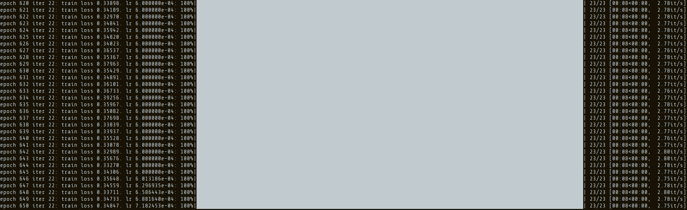

# Assignment Results and TODOs
## Part c & d: Vanilla model (causal multiheaded self-attention) without pretraining.
This execution just finetunes the model with the downstream task and dataset. When I say finetuning it is just a trainig step setting the objective as answering the place where a person was born. The training data is the downstream task dataset, i.e., tuples of questions about where somebody was born, and answers containing the answer.
1. Train the vanilla model w/o pretraning through the finetuning parameter:
   - Command: `python src/run.py finetune vanilla wiki.txt --writing_params_path vanilla.model.params --finetune_corpus_path birth_places_train.tsv`
   - Results:
     - Epochs: 75
     - Training loss: 0.21965
     - LR: 5.100024e-04

2. Evaluate the vanilla model on the dev set:
   - Command: `python src/run.py evaluate vanilla wiki.txt --reading_params_path vanilla.model.params --eval_corpus_path birth_dev.tsv --outputs_path vanilla.nopretrain.dev.predictions`
   - Results:
      ```
     Data has 418352 characters, 256 unique.
      - number of parameters: 3323392
      - 500it [01:02,  8.20it/s]
      - Correct: 7.0 out of 500.0: 1.4000000000000001%
      ```

3. Evaluate the vanilla model on the test set. No score since the test set don't have true labels. The predictions are saved in `--outputs_path`
   - Command: `python src/run.py evaluate vanilla wiki.txt --reading_params_path vanilla.model.params --eval_corpus_path birth_test_inputs.tsv --outputs_path vanilla.nopretrain.test.predictions`

4. London baseline (the accuracy if the model would predict London for each line of the dev set):
   ```
   Correct: 25.0 out of 500.0: 5.0%
   ```

## Part f: Vanilla model (causal multiheaded self-attention) with pretraining and finetuning
1. Pretrain model with a general knowledge dataset (wikidata content where persons name appear close to a place of birth). The model objective is predict the corrupted spans of input.
   - Command: `python src/run.py pretrain vanilla wiki.txt --writing_params_path vanilla.pretrain.params`
   - Results:
      <p align='center'>
      
      </p>

2. Finetune the vanilla model with the downstream task (predicting the place where a person was born). Uses finetuning dataset that contains pairs of input text (questions about where a person was born) and truth labels (the place where the person was born):
   - Command: `python src/run.py finetune vanilla wiki.txt --reading_params_path vanilla.pretrain.params --writing_params_path vanilla.finetune.params --finetune_corpus_path birth_places_train.tsv`
   - Results:
      <p align='center'>
      
      </p>

3. Evaluate the vanilla model on dev set (contains questions and ground truths):
   - Command: `python src/run.py evaluate vanilla wiki.txt --reading_params_path vanilla.finetune.params --eval_corpus_path birth_dev.tsv --outputs_path vanilla.pretrain.dev.predictions`
   - Results: This is much better than training the Vanilla model with the downstream task and dataset (1.4%). This means <em>pretraining works</em>!
      <p align='center'>
      
      </p>

4. Evaluate on test set (contains questions only, to be evaluated bu Stanford's TAs):
   - Command: `python src/run.py evaluate vanilla wiki.txt --reading_params_path vanilla.finetune.params --eval_corpus_path birth_test_inputs.tsv --outputs_path vanilla.pretrain.test.predictions`
   - Results:
      <p align='center'>
      
      </p>

## Part g: Synthesizer model (synthesizer multiheaded self-attention) with pretraining and finetuning
1. Pretrain the model:
   - Command: `python src/run.py pretrain synthesizer wiki.txt --writing_params_path synthesizer.pretrain.params`
   - Results:
      <p align='center'>
      
      </p>

2. Finetune the model:
   - Command: `python src/run.py finetune synthesizer wiki.txt --reading_params_path synthesizer.pretrain.params --writing_params_path synthesizer.finetune.params --finetune_corpus_path birth_places_train.tsv`
   - Results:
      <p align='center'>
      
      </p>

3. Evaluate on dev set:
   - Command: `python src/run.py evaluate synthesizer wiki.txt --reading_params_path synthesizer.finetune.params --eval_corpus_path birth_dev.tsv --outputs_path synthesizer.pretrain.dev.predictions`
   - Results: The computation is easier since we get rid off the quadratic factor, nevertheless the results are not that great, i.e., better than the Vanilla training without pretraining, <em>but similar to the baseline (London)</em>.
      <p align='center'>
      
      </p>

4. Evaluate on test set:
   - Command: `python src/run.py evaluate synthesizer wiki.txt --reading_params_path synthesizer.finetune.params --eval_corpus_path birth_test_inputs.tsv --outputs_path synthesizer.pretrain.test.predictions`
   - Results:
      <p align='center'>
      
      </p>